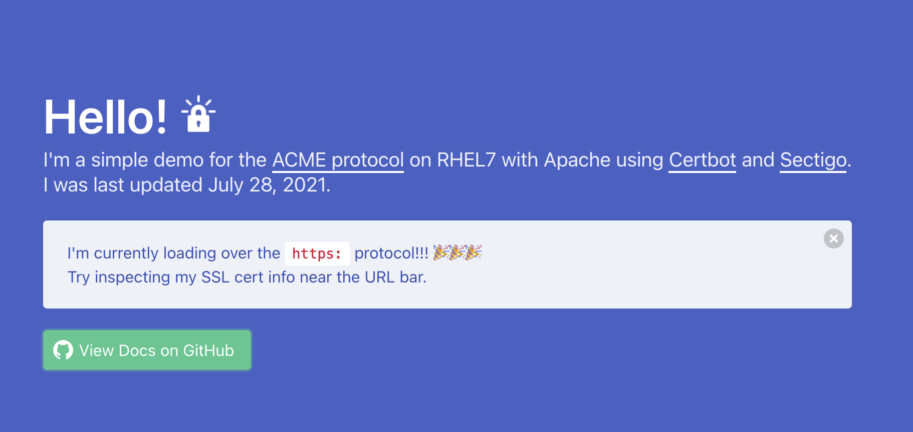

# acme-certbot-demo

**This repo provides documentation and a proof-of-concept scaffold for cert automation using the [ACME protocol](https://sectigo.com/resource-library/what-is-acme-protocol).**

The poc (currently deployed at http://dco01la-1692s.cfs.its.nyu.edu/) can be recreated by following along with [Steps to Reproduce](docs/STEPS_TO_REPRODUCE.md) on a RHEL7 VM.

It uses [Certbot](https://certbot.eff.org/) to:
1. provision and manage SSL certificates, and
2.  configure Apache2 to use them.

The poc posits a semi-manual process that should be automated at a later date with more agnostic shell scripts and/or a provisioning tool like [Ansible](https://www.ansible.com/). (see: [Recommendations](docs/RECOMMENDATIONS.md)).

Lastly, Certbot's default ACME client is [Boulder](https://github.com/letsencrypt/boulder) (from [Let's Encrypt](https://letsencrypt.org/)), but it can register other ACME-compliant CAs including [Sectigo](https://sectigo.com/). This is an optional step marked in [Steps to Reproduce](docs/STEPS_TO_REPRODUCE.md).

## ToC
- [Steps to Reproduce](docs/STEPS_TO_REPRODUCE.md)
- [Additional Resources](docs/RESOURCES.md)
- [Recommendations](docs/RECOMMENDATIONS.md)
